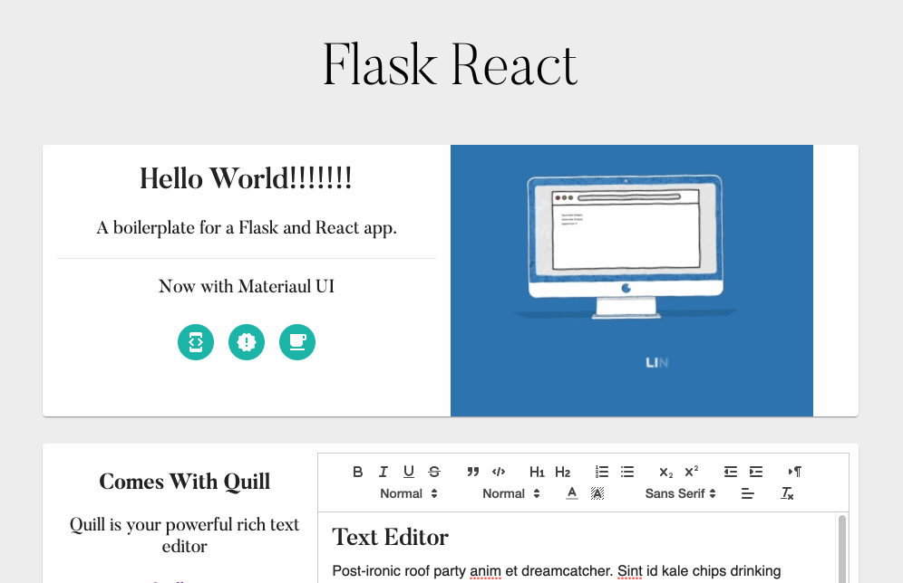

<h1 align="center" style="font-weight: ligher;">
  Flask React
</h1>

Because getting started developing with flask and react can be easier, this boilerplate for developing a flask and react web apps exists. This is a docker-compose script that builds a flask API with a react front end. Live reload for both frameworks is automatically on, so you can get right to code an app.



## Usage

To use Flask React pull the repository and open the repository root, then run this command: 
```shell
docker-compose up
```

You should be able to go to http://localhost:5000 to see the front end after the initial build finishes. It's that simple.